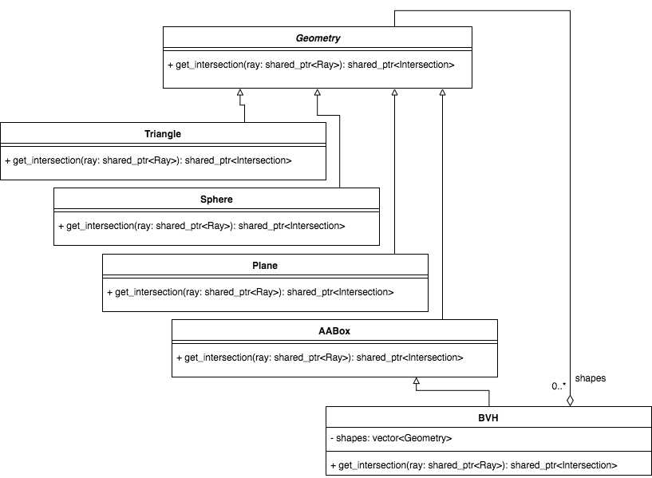

# RayTracer
Class assignment for CPE 473

## Software Design

One componet of my ray tracer project that I am particularly proud of was my implementation of a BVH (Bounding Volume Hierarchy). I took advantage of a software design pattern called the [Composite Pattern](https://en.wikipedia.org/wiki/Composite_pattern) that let me easily add support for this spatial data structure.

The base class I used was the `Geometry` abstract class. This was the parent class for all shapes in the scene including `Triagle`, `Sphere`, `Plane`, and `AABox`.

`Geometry` has an abstract method `get_intersection` that returns an intersection object based off of a ray. Each shape had a concrete implementation of this.

Until now, this has been basic OOP inheritance. The magic was created when I added the `BVH` class as a subclass of `AABox`. `BVH` is an axis-aligned box that holds a vector of shapes that it completely surrounds. I then override the `get_intersection` method to:

1. call the super class (`AABox`) intersection to see if a ray could intersect any of the shapes.
1. check if there is an intersection with the `BVH`
1. if there isn't return null.
1. iterate through the shapes and call their `get_intersection` methods.
1. return the closest intersection.

Since `BVH` is ultimately a descendant of `Geometry`, a single root to the BVH tree could be put inside the `Scene` class's list of shapes, and calling `get_intersection` on that root `BVH` would cleanly traverse the whole BVH tree to find the intersection point.

The structure is explained in this class diagram

## Final Project: Ambient Occlusion

Ambient occlusion is a technique for approximating shadows when determining the ambient light component for local shading. This is done by casting several rays in a hemisphere around the normal from a incident ray's intersection point. The ambient light component is then divided by the number of these rays that actually intersect something in the scene.

The Monte Carlo ambient lighting technique already provides a mechanism for casting these rays in a hemisphere, so I leveraged that code. The only modification was simply counting the number of these rays that hit another object. I then divided the ambient lighting component by this count.

The reason that this works is because when a hemisphere of random rays are cast where two objects are close together, many of these rays will intersect with another object. This reduces the ambient contribution to local shading and provides a good approximation of shadows.

### Examples

Below are some examples of the same image with and without ambient occlusion and monte carlo global illumination.

|Neither | GI | AO | Both |
|---|---|---|---|
|||||
|||||

### Resources for Implementing Ambient Occlusion

1. [renderWiki](http://joomla.renderwiki.com/joomla/index.php?option=com_content&view=article&id=140&Itemid=157)
1. [wikipedia](https://en.wikipedia.org/wiki/Ambient_occlusion)
1. [fundza.com](http://www.fundza.com/rman_shaders/ray/ambient_occlusion/index.html)
